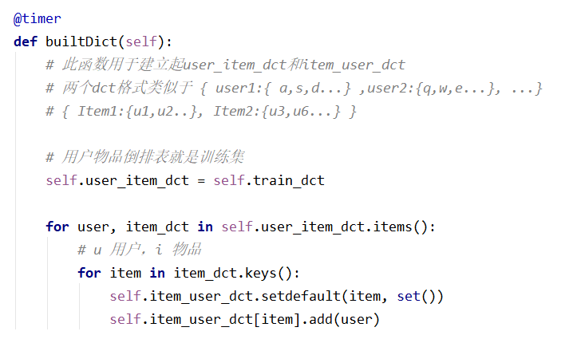
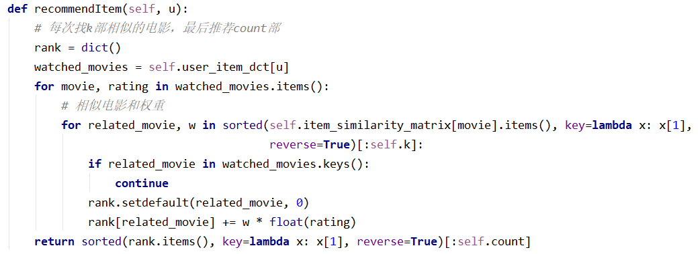
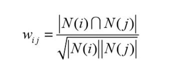
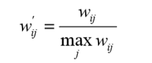
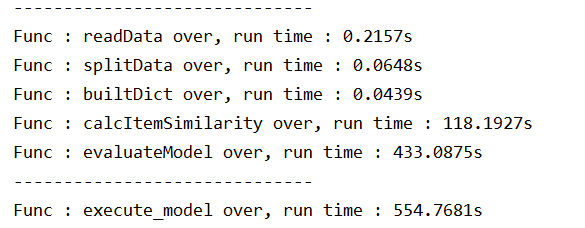
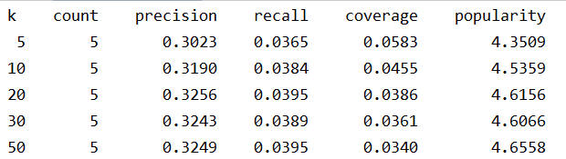
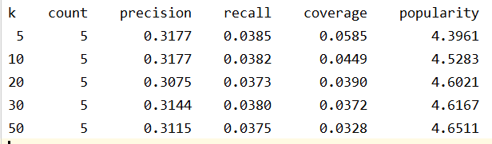

# README

ItemCF的步骤：

1. 计算物品之间的相似度
2. 根据物品的相似度和用户的历史行为给用户推荐生成列表

具体做法：

1. 生成用户-物品倒排表和物品-用户倒排表，方便计算

   

2. 计算相似度矩阵，也就是对训练集中的每个Item，计算它与其它Item之间的相似度

   这个矩阵是稀疏矩阵，计算的一个小技巧就是只计算那些有用户交集的Item，有了之前的倒排表，这一步很容易实现

   
   
   （以基础的ItemCF为例）
   
3. 生成推荐列表

   

   对用户u做推荐，就是根据他评分列表中的物品，找到最相似的k个物品，然后计算这些物品的兴趣值，最后返回count个兴趣值最高的物品即可

---

ItemCF基础相似度计算公式：

物品i和j的相似度，是找到喜欢物品i的用户和喜欢物品j的用户中有多少用户是同一个人，也就是求两个集合的交集

改进的相似度计算公式：

计算相似度矩阵完成后，对相似度矩阵做归一化处理

---

单次运行时间（Item CF）：

基础的ItemCF算法运行结果：

ItemCF-Norm的运行结果：

---

注意事项：

ItemCF的运行需要建立物品矩阵，运行时内存达到4G以上，所以要用64位的Python，32位的Python运行的时候会报内存不足的错误

