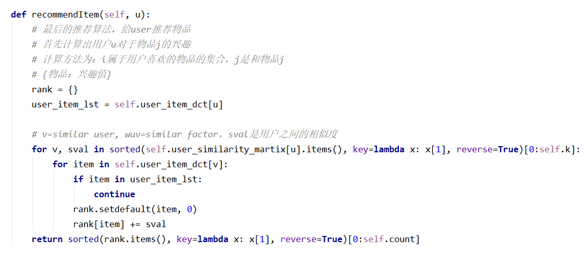

# README

UserCF的步骤：

1. 计算用户之间的相似度
2. 根据相似用户喜欢的物品，来给当前用户做推荐

具体做法：

1. 建立倒排表方便计算

   

2. 计算用户相似矩阵

   

   （以UserCF为例）

3. 推荐函数

   

---

UserCF的相似度计算公式：

UserIIF的改进：

---

UserCF的运行结果

UserIIF的运行结果

---

